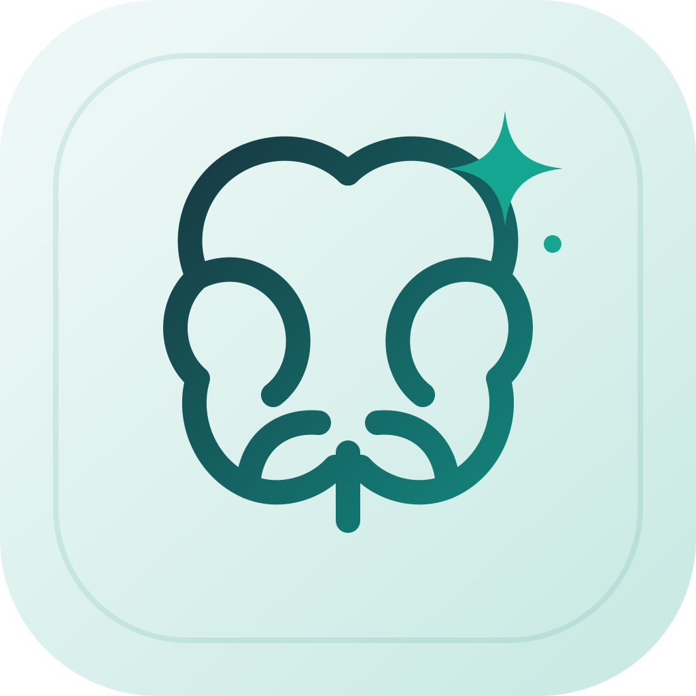

<p align="center">
  
</p>

# brainwash

[点击此处阅读中文文档](README_CN.md)

Wash one agent's memory into another agent's brain.

Currently supports:

**pi · Codex · Claude Code · DeepSeek Harness**

Convert sessions between them. You can also export to our own **.pm** format (Packed Memory) for moving chats across devices. Cloud sessions might show up later.

Parsers are pluggable. If your favorite agent isn't listed, or this doesn't quite cover you, adding a new parser should be easy — PRs welcome.

## Install

> The GUI currently ships for macOS Apple Silicon only. Other macOS architectures: build it yourself. Other OSes: use brainwash-cli — same features.

### GUI

#### Installer

1. Grab a package from [Releases](https://github.com/GeesecSecurity/brainwash/releases) (the one ending in `.pkg`).
2. Double-click to install.

#### From source

```bash
git clone https://github.com/GeesecSecurity/brainwash.git
cd brainwash
make run-gui    # builds dist/brainwash.app and opens it
```

### CLI

1. From [Releases](https://github.com/GeesecSecurity/brainwash/releases), download `brainwash-cli` for your OS and arch.
2. Or clone the repo and build it yourself. If you're reading this, you already know how, right?

## Usage

### GUI

1. Pick the source agent on the left, wait for the session list.
2. Open a conversation.
3. On the right, pick the destination agent, hit **Brainwash**.
4. Taking a memory with you? **Export** writes a `.pm` for the current session.
5. To import, click **Import**, pick a folder / session, then drop the `.pm` in.

### CLI

```bash
brainwash-cli list --slot pi
brainwash-cli show --slot codex --latest
brainwash-cli clone --from codex --to pi --latest --out-cwd /path/to/project
brainwash-cli export --slot pi --latest          # writes ./<uuid>.pm
brainwash-cli import --file <uuid>.pm --to claude --out-cwd /path/to/project
```
