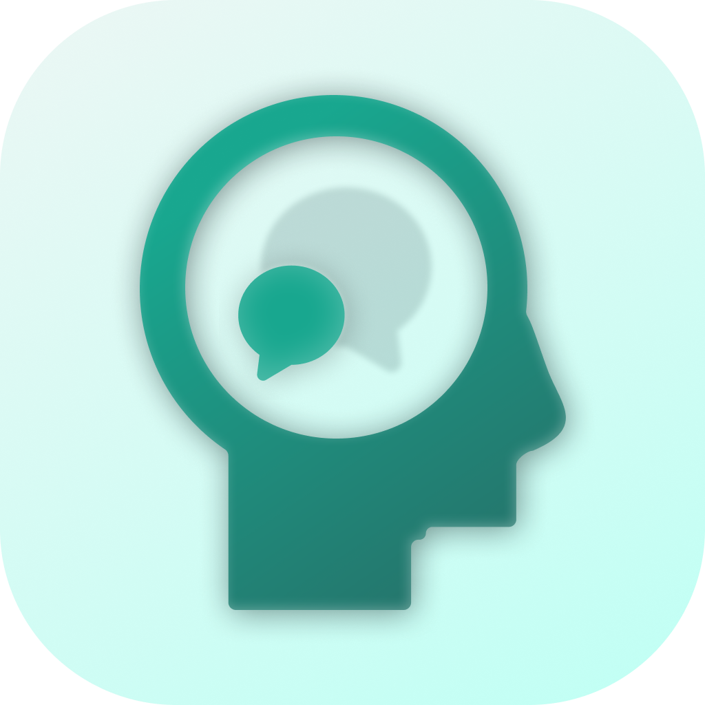

<p align="center">
  
</p>

# brainwash

把一个 Agent 的记忆，洗进另一个的脑子里。

目前支持：

**pi · Codex · Claude Code · DeepSeek Harness**

之间的会话互相转换，也支持导出会话到我们自有的格式 **.pm**（Packed Memory）以进行跨设备传输，未来考虑加入云端会话的支持

会话解析器的设计是可拓展的，所以如果上方不是你常用的 Agent，或是不能覆盖到你的需求，你应该可以很轻易的加入新的解析器，届时欢迎提交PR。

## 安装

> 目前图形界面仅提供 macOS Apple Silicon 版本，其他 macOS 架构请自行编译；其他操作系统请使用 brainwash-cli，功能完全一致

### 图形界面

#### 直接安装

1. 去 [Releases](https://github.com/GeesecSecurity/brainwash/releases) 下载安装包（以pkg结尾）。
2. 双击安装。

#### 源码安装

```bash
git clone https://github.com/GeesecSecurity/brainwash.git
cd brainwash
make run-gui    # 打包 dist/brainwash.app 并打开
```

### 命令行

1. 去 [Releases](https://github.com/GeesecSecurity/brainwash/releases) 下载对应系统对应架构的 `brainwash-cli` 安装包。
2. 或者克隆下项目自己编译，如果你在看这个我想你应该知道怎么做对吧？

## 使用方法

### 图形界面

1. 左侧选择源 Agent，等待会话列表加载。
2. 点开一段对话。
3. 右侧选好目标 Agent，点 **洗入**。
4. 要带走记忆？**导出** 会导出当前会回的 `.pm`。
5. 导入记忆请点击 **导入** 选择好文件夹 / 会话后把 `.pm` 拖进去。

### 命令行

```bash
brainwash-cli list --slot pi
brainwash-cli show --slot codex --latest
brainwash-cli clone --from codex --to pi --latest --out-cwd /path/to/project
brainwash-cli export --slot pi --latest          # 写出 ./<uuid>.pm
brainwash-cli import --file <uuid>.pm --to claude --out-cwd /path/to/project
```

